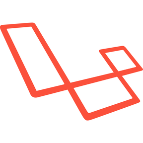
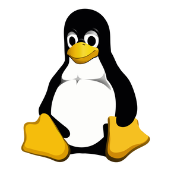

## Hi, my name is Jakub

- 🔭 I’m currently working on [new video game](https://lizards.games/chameleon "Chameleon")
- 🌱 I’m currently learning Symfony
- 👯 I’m looking to collaborate on [LizardsGames project](https://lizards.games "LizardsGames")
- ⚡ Fun fact: I love watermelons
- 📧 Contact me: jakub@korytko.me

## Some technologies that i use:

